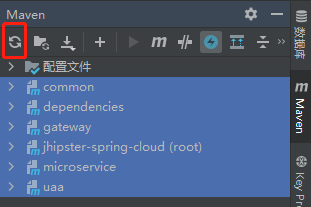
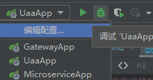

# 开发环境配置

- 安装 IDEA
- 安装 Maven, 添加 aliyun Maven 镜像仓库
- 修改 IDEA 中 Maven 配置, 选择自己安装的 Maven 目录和 settings.xml 配置文件
- 开启 IDEA 注解处理器配置
- 安装插件: Lombok, MapStruct, Maven Helper
- 选择右边工具栏中的 Maven 插件, 修改项目配置 
- 选择指定模块, 点击刷新按钮更新依赖 
- 选择指定服务点击启动 