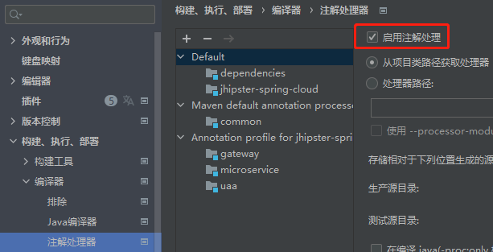
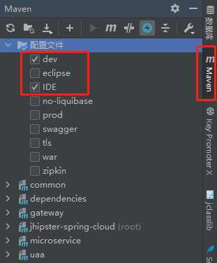
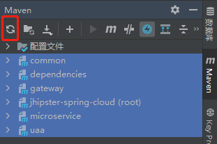

# 开发环境配置

- 安装 JDK 1.8 版本, 配置系统环境变量
- 安装 IDEA 2021.1+ 版本
- 安装 Maven 3.6.x 版本, 配置系统环境变量, 修改 `apache-maven-3.6.1/conf/settings.xml` 配置文件, 添加 aliyun Maven 镜像仓库配置
  ```xml
  <mirror>
      <id>aliyun</id>
      <mirrorOf>central</mirrorOf>
      <name>aliyun-central</name>
      <url>https://maven.aliyun.com/repository/central</url>
  </mirror>
  ```
- 修改 IDEA 中 Maven 配置, 选择自己安装的 Maven 目录和 settings.xml 配置文件以及本地仓库目录
- 开启 IDEA 注解处理器配置
  > 
- 安装插件: Lombok, MapStruct, Maven Helper
- 选择右边工具栏中的 Maven 插件, 修改项目配置
  > 
- 选择指定模块, 点击刷新按钮更新依赖
  > 
- 选择指定服务点击启动
  > 