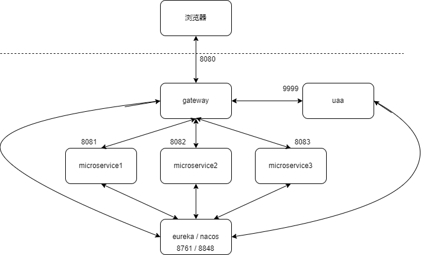
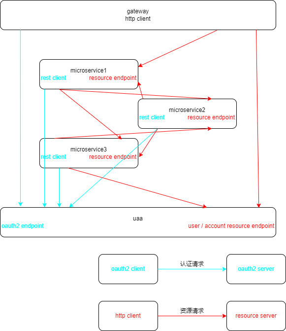

# Gateway 使用说明

网关是普通的应用程序，因此您可以在该项目上使用常规的开发工作流，但它也充当微服务的入口。更具体地说，它为所有微服务提供 HTTP 路由和负载均衡，服务质量，安全性和 API 文档。

### 架构图

> 

### 微服务调用链

> 

### HTTP 请求使用网关进行路由

启动 UAA、网关和微服务后，它们将在 **Eureka / Nacos**
中注册自己（使用 `src/main/resources/config/application.yml` 文件中的 `eureka.client.serviceUrl.defaultZone`
或者 `spring.cloud.nacos.discovery.server-addr`项）。

网关将使用其应用程序名字自动将所有请求代理到微服务：例如，注册微服务 `microservice` 时，该请求在网关上的 `/gateway/microservice` URL 上可用。

例如，如果您的网关运行在 [http://localhost:8080](http://localhost:8080)
上，则可以指向 [http://localhost:8080/gateway/microservice/api/resources](http://localhost:8080/gateway/microservice/api/resources)
来获取微服务 `microservice` 服务的 `resources` 资源。 如果您尝试使用 Web 浏览器执行此操作，请不要忘记 REST 资源在微服务中是默认保护的，因此您需要发送正确的 JWT
标头（请参见下面的安全性要点），或在微服务的 `MicroserviceSecurityConfiguration` 类删除这些 URL 安全保护。

如果有多个运行同一服务的实例，则网关将从 **Eureka / Nacos** 获取这些实例，并将：

- 使用 *Spring Coud Load Balancer(Ribbon)* 负载均衡 HTTP 请求。
- 使用 *Hystrix* 提供断路器，以便快速，安全地删除发生故障的实例。

网关可以在其中监视打开的 HTTP 路由和微服务实例。

如果有多个运行同一服务的实例，则网关将从 **Eureka / Nacos** 获取这些实例，并将： 使用 **Ribbon** 负载均衡 HTTP 请求。

### 限流

使用 **Bucket4j** 和 **Hazelcast** 提供微服务上的服务质量。

网关提供速率限制功能，因此可以限制 REST 请求的数量：

- 通过 IP 地址（对于匿名用户）
- 通过用户登录（对于已登录的用户）

然后，网关将使用 **Bucket4j** 和 **Hazelcast** 请求计数，并在超出限制时发送 HTTP 429（请求过多）错误。每个用户的默认限制是每小时 100,000 个 API 调用。

这样可以保护微服务架构免于被特定用户的请求所雪崩。

网关在保护 REST 端点安全时，可以完全访问用户的安全信息，因此可以扩展它，以根据用户的安全角色提供特定的速率限制。

要启用速率限制，请打开 `application-dev.yml` 或 `application-prod.yml` 文件，并将 `enabled` 设置为 `true`：

```yaml
jhipster:
  gateway:
    rate-limiting:
      enabled: true
```

数据存储在 **Hazelcast** 中，因此，只要配置了 **Hazelcast** 分布式缓存，便可以扩展网关，该网关可以直接使用：

- 默认情况下，网关都配置了 **Hazelcast**
- 如果使用 **JHipster Registry(Eureka)**，则网关的所有实例都应自动在分布式缓存中注册自己

如果要添加更多规则或修改现有规则，则需要在 `RateLimitingFilter` 类中对其进行编码。修改示例：

- 降低 HTTP 调用的限制
- 增加每分钟或每天限制
- 取消 *admin* 用户的所有限制

### 访问控制策略

默认情况下，所有已注册的微服务都可以通过网关来访问。如果要排除通过网关公开访问的特定 API，可以使用网关的特定访问控制策略过滤器。可以使用 `application-*.yml`
文件中的 `jhipster.gateway.authorized-microservices-endpoints` 密钥对其进行配置：

```yaml
jhipster:
  gateway:
    authorized-microservices-endpoints: # Access Control Policy, if left empty for a route, all endpoints will be accessible
      app1: /api,/v2/api-docs # recommended dev configuration
```

例如，如果您只希望微服务 `microservice` 的 `/api/resources` API 端点可用：

```yaml
jhipster:
  gateway:
    authorized-microservices-endpoints:
      microservice: /api/resources
```

### 接口服务说明

认证管理接口: `com.example.gateway.web.rest.AuthResource`

路由管理接口: `com.example.gateway.web.rest.GatewayResource`

详情请查看 [swagger](http://localhost:8080) 文档